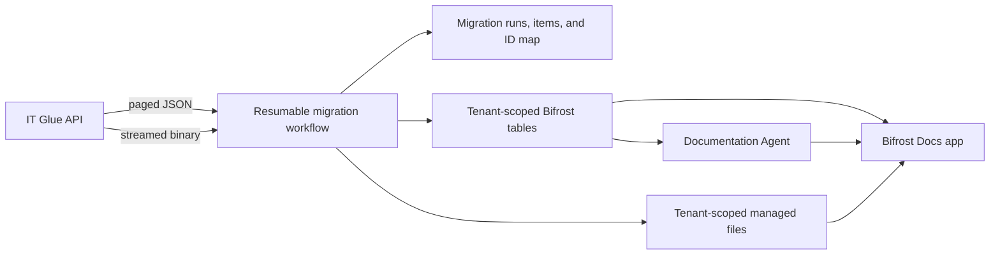

# Bifrost Docs architecture

## Decision

Bifrost Docs is a global, provider-operated Solution whose business records are
owned by actual Bifrost organizations. IT Glue is the source of truth during
migration. Bifrost becomes authoritative only after the final-delta reconciliation
and explicit go-live approval. Until then, each completed sync is one-way: it
creates IT Glue-owned Bifrost copies, overwrites their mapped fields only after an IT
Glue source change, and deletes only confirmed source-deleted copies. Local edits to
a mapped Bifrost copy remain until the next source change. Native Bifrost records are
never overwritten or deleted by the IT Glue migration.

The importer uses the IT Glue REST API. Account-export ZIPs are not part of the
normal path: an unknown multi-gigabyte ZIP plus extraction is not a safe workload
contract. The API-first path does not depend on node disk capacity.

## Boundaries

### Tenant boundary

Every migrated business row contains the target Bifrost `organization_id`. Table
policies allow provider users to operate across customers and customer users to see
only rows matching their organization. File objects are written with the target
organization as their Bifrost file scope.

IT Glue organization IDs are never used as authorization boundaries. They are
retained only as source identifiers in the migration map. The Solution declares
the `IT Glue` Integration, including its required `api_key` secret, in
`.bifrost/connections.yaml`. The administrator configures that key and each
organization mapping in the Integration: the Bifrost organization is the mapping
scope and its external entity ID is the IT Glue organization ID. The importer uses
only those mappings; it neither matches names nor accepts manual ID pairs. The
Integration may also set `base_url`; otherwise the importer uses the IT Glue API
default documented in the README.

### Password boundary

`docs-passwords` stores password metadata and an IT Glue source-page link only.
Password values, TOTP values, and embedded flexible-asset secret values are not
migrated, stored, indexed, returned by workflows, passed to the agent, or logged.
The Bifrost Docs app directs a user to the source page when the source URL is
available.

### Files

Document images and attachments are not staged on worker disk. The migration obtains
a destination signed URL, opens the IT Glue download response as a stream, and
forwards chunks to managed storage. Metadata is committed only after the destination
upload succeeds. A partially transferred object is safe to retry because its object
key is deterministic. Restricted documents and folder descendants retain their
restricted marker, and their images and attachments are written to the corresponding
restricted managed-file location rather than the general content location.

### Knowledge and application scope

Knowledge indexing is deliberately a safe subset: it accepts only non-restricted,
non-archived document content with a stable citation and rejects a row with
secret-shaped data. Restricted or otherwise ineligible rows remove any existing
knowledge entry. The app contract is role-aware full CRUD for supported documentation
records, with source links, attachment and relationship handling, and an
Administrator-only migration area. Password records remain metadata/link-only; this
does not authorize password-value CRUD. Static code presence is not browser, policy,
or role-QA evidence.

### Native authoring

The agent-first authoring path creates and revises organization-scoped,
Bifrost-authored document drafts. Explicit confirmation plus a provider or platform
`Bifrost Docs Administrator` is required to publish. Provider-authored documents
remain available to the provider organization and do not create a global
customer-visible library. Native documents are independent of IT Glue mappings and
are never overwritten by migration.

### Checkpoints and identity

Each destination row ID is UUIDv5 over:

`bifrost-docs:<target-org>:<resource-type>:<source-id>`

This gives every retry the same destination. `docs-migration-items` records the
resource state (`pending`, `running`, `succeeded`, `failed`, or `skipped`) and
attempt count. The run row holds phase/page cursors, a durable organization-mapping
queue, source-observation watermarks, reconciliation counts, cancellation state,
aggregate counts, and the latest execution ID. Delta runs skip only when an explicit
source `updated-at` matches the source map and the destination row still exists.

Reconciliation uses the per-run item table as a disk-backed seen ledger, so it does
not hold a tenant-sized ID set in memory. A mapped IT Glue row is skipped when its
source watermark and source fingerprint are unchanged, preserving local edits. An
IT Glue-owned destination becomes a deletion candidate only after a complete source
enumeration omitted its ID; the importer then performs a direct source GET and
deletes it only if that request returns 404. Other errors, incomplete enumeration,
and native Bifrost rows are retained.

A 24-hour workflow timeout is operational headroom, not the reliability mechanism.
The system remains correct if a worker stops between any two resources.

## Migration phases

1. Read the configured IT Glue Integration mappings; each mapping binds an existing
   Bifrost organization to its IT Glue organization ID.
2. Migrate folder/reference structures.
3. Migrate locations and configurations, including interfaces.
4. Migrate documents, sections, and flexible assets.
5. Migrate password metadata and the IT Glue source-page link; never migrate values
   or TOTP secrets.
6. Stream document images and attachments.
7. Rebuild related-item relationships.
8. Reconcile source enumeration against destination rows and file metadata.
9. Build/search-index only after reconciliation is clean.

## Non-goals for the migration worker

- No full account ZIP generation, download, or extraction.
- No unbounded in-memory pagination result.
- No logging of API keys, passwords, OTP secrets, signed URLs, or document bodies.
- No Bifrost organization creation, name matching, or manual source/target ID pairs.
- No automatic source deletion or source write lock.

## Backup and recovery boundary

Recovery uses Bifrost platform full backup rather than an app export. A backup is
captures all registered managed files and preserves document IDs. Exports fail
closed above 50,000 rows per table; the restore artifact is available for seven
days. Verify the selected scope is supported; a
restore rehearsal must also confirm that the restored IT Glue Integration credential
is present and can authenticate before it is relied on for migration recovery. This
is a documented recovery requirement, not a live-verified result.
